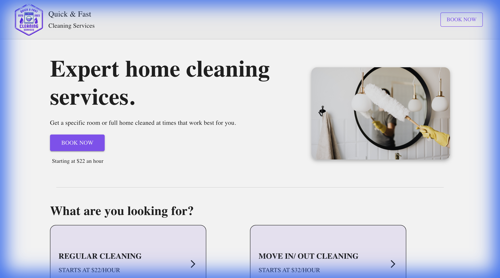

# Cleaning Service App

## Table of Contents
* [Description](#description)
* [Sneak-Peek](#sneak-peek)
* [Getting Started](#getting-started)
* [Contributing](#contributing)
* [What I Learned](#what-i-learned)
* [Questions?](#questions)


## Description
A full-stack web application designed for booking cleaning services. This project demonstrates a modern architecture using the MERN stack with GraphQL.

This application allows users to browse cleaning services, view schedules, and book appointments. It features:
* **Frontend:** A responsive React UI (Material UI + Tailwind CSS) where users can navigate through "Home", "Schedule", "About Us", and "Booking" pages.
* **Backend:** A GraphQL API (Apollo Server) that handles data requests for bookings and services.
* **Database:** MongoDB integration for storing booking and service data.
* **Booking Flow:** Users can select a date and time to book a cleaning service, which is then processed by the backend.

## Sneak-Peek



## Getting Started

### Prerequisites
- Node.js (v20+ recommended)
- MongoDB (Community Edition or Atlas Cluster)

### 1. Backend Setup
Navigate to the server directory and start the backend:
```bash
cd apollo-server
npm install
npm start
```
*The GraphQL server will typically run on `http://localhost:4000`.*

### 2. Frontend Setup
Open a new terminal, navigate to the UI directory, and start the React app:
```bash
cd web-ui
npm install
npm start
```
*The application will launch in your default browser.*


## Contributing

Contributions are always accepted.

---

## What I Learned
Creating this code sample provided valuable hands-on experience in:
- **Full-Stack Integration:** Connecting a React frontend to a Node.js backend using Apollo and GraphQL.
- **GraphQL Mastery:** Understanding how to define schemas (`typeDefs`) and `resolvers` to replace traditional REST API endpoints.
- **State Management:** Using Apollo Client to fetch, cache, and modify server-side data efficiently.
- **Database Operations:** performing CRUD operations with Mongoose and MongoDB.
- **UI Design:** Combining Material UI components with Tailwind CSS for a polished look.


## Questions?

 

For any questions, please contact me with the information below:

Email: <<Midouinmakendy@gmail.com>>
